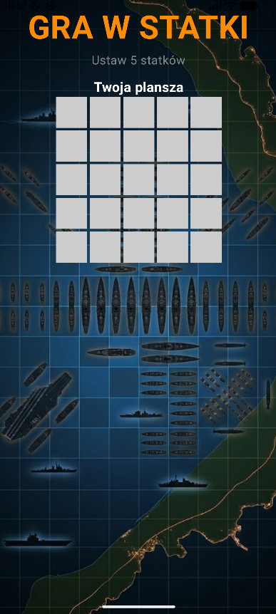
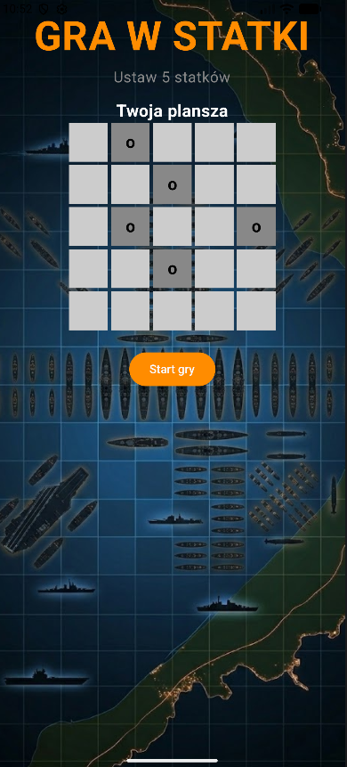
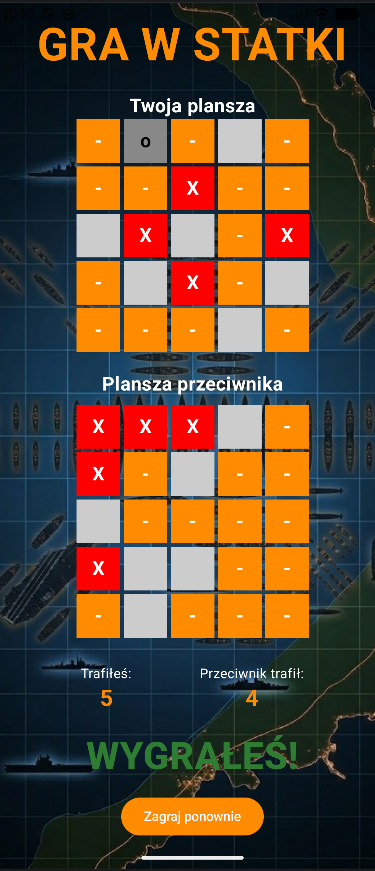

# Battleship-game
Simple mobile Battleship game created in Kotlin for Android Studio.

## Features
- 5x5 game board
- Ship placement system
- AI opponent
- Hit and miss detection
- Win/lose conditions
- Restart game option

## Screenshots

### Main Screen


### Ships setup


### Victory Screen


## Technologies
- Kotlin
- Jetpack Compose
- Android Studio

## Installation

1. Clone the repository:
```bash
git clone https://github.com/Bonuz26/android-battleship.git
```
2. Open the project in Android Studio.
3. Wait for Gradle synchronization.
4. Run the application on an emulator or Android device.
